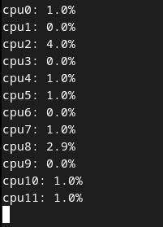

# CPUT - CPU Tracker

## Information

The simple program that displays percentage information about CPU usage for each thread. Works only on Linux computers.



## Installation

In the terminal, inside cput folder type:

```bash
mkdir obj
make
```

## License

[MIT](./LICENSE)
